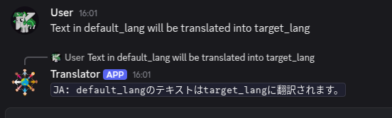
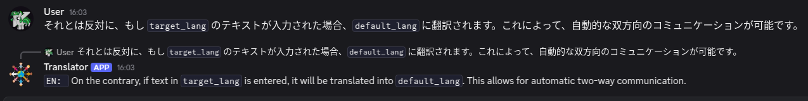
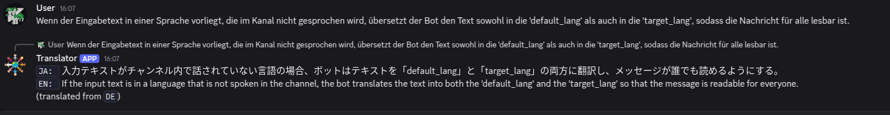
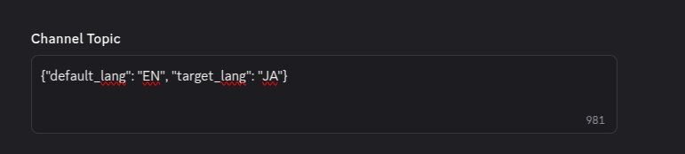

# DeepL - Discord auto chat translator

Game players must not be separated because of language barriers.

## Use cases

#### Auto Translation from `Default Language` in the channel to `Target Language`
Without a command, the bot automatically translates messages in the channel from the `Default Language` to the `Target Language` configured in the channel topic.



#### Counter translation from `Target Language` to `Default Language`
As reply to the translated message, the bot automatically translates messages in the channel from the `Target Language` to the `Default Language`.


#### Translaion from text in unknown language
In case someone who don't speak neither `Default Language` nor `Target Language`, the bot automatically detects the language and translates it to both `Default Language` and `Target Language`.



## Conffiguration
### Set Required Tokens
Simply copy `.env.example` to `.env` and fill in the required tokens.

### Target language configuration for channel

Add text below in topic of channel that you want to translate messages.

```
{
    "default_lang": "EN",
    "target_lang": "JA"
}
```

- default_lang: default language spoken in the channel.
- target_lang: language to translate messages to.




## Requirements and Build
- Rust 1.87.0 or later
- Cargo

```console
carg build --release
```

## Run Bot

```console
cargo run --release
```
